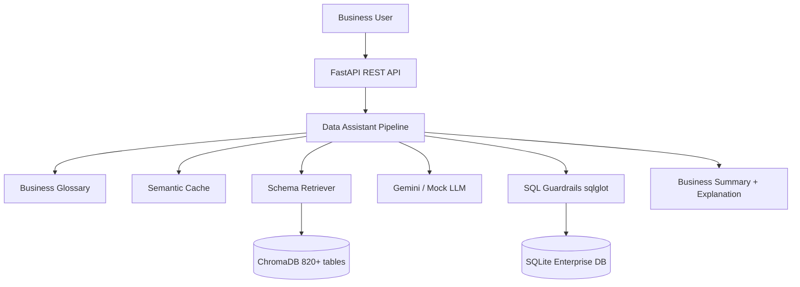

# Architecture — Enterprise AI Data Assistant

## Overview

## Layers

| Layer | Responsibility |
|-------|----------------|
| **API** | REST endpoints, validation, error mapping |
| **Pipeline** | Orchestrates NL → SQL → execute → summarize |
| **Retrieval** | Embeds 820+ schema metadata; returns top-K DDL |
| **LLM** | SQL generation, self-healing, explanation, summary |
| **Security** | AST-based read-only enforcement |
| **Database** | 13 executable tables with seeded enterprise sample data |

## Design decisions

1. **800+ table simulation**: Metadata catalog with 820 entries; vector index for retrieval; 13 physical tables for safe execution.
2. **RAG on schemas**: Avoids stuffing full catalog into LLM context.
3. **Retry loop**: Up to 3 execution attempts with LLM self-healing.
4. **Mock LLM mode**: Runs without API key for local demos and grading.

## API surface

- `POST /api/v1/query` — main NLP-to-SQL flow
- `GET /api/v1/health` — service health
- `GET /api/v1/schema/stats` — catalog statistics
- `GET /docs` — Swagger UI
